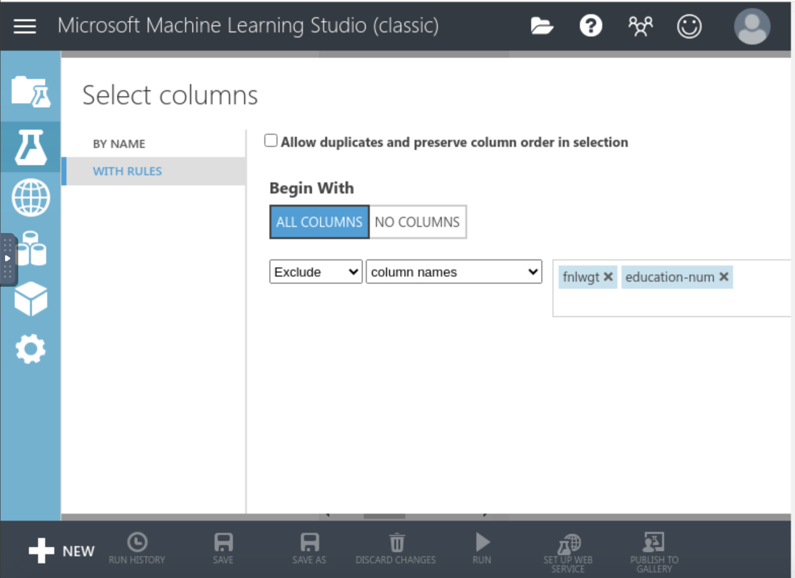
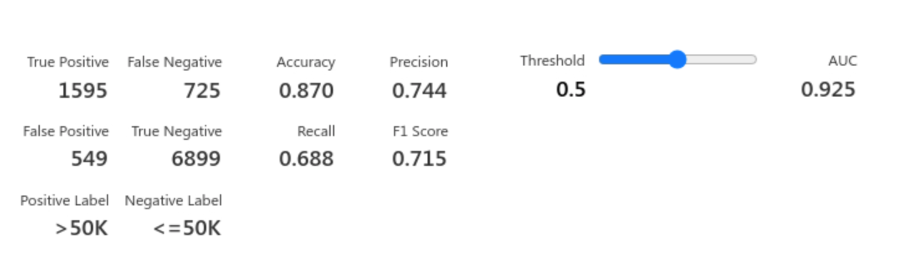

# Income Prediction with Azure ML Studio

Using the Adult Census data, I will build two boosted decision tree models (one model will be trained on the upsampled data, and the other with just the original pre-processed data) and create an end-to-end pipeline using Azure ML Studio. The objectives are the following:

- Pre-process the data
- Train and evaluate the model with Azure ML Studio
- Create scoring and predictive experiments
- Deploy the trained model as an Azure web service

## Model Selection- Boosted Decision Tree

A Boosted Decision Tree is an ensemble learning technique that combines the predictions of multiple decision trees to produce a more accurate and robust model. The boosting process involves training several decision trees sequentially, where each tree is trained to correct the errors of the previous ones

In the context of predicting adult income, using a boosted decision tree model is particularly advantageous because it can efficiently handle the complexities and variabilities inherent in the data. The socioeconomic factors influencing income are multifaceted and often interact in non-linear ways. Boosted decision trees are capable of capturing these intricate patterns, leading to more accurate and reliable predictions. Moreover, the ability to interpret feature importance allows for better understanding and communication of the key drivers of income levels, supporting data-driven decision-making.

### Task I- Introduction and Overview

- Create a new experiment from the Azure ML Studio dashboard
- Import and explore the Adult Census data before moving on to pre-processing

a) Importing the dataset

b) Viewing the class imbalance

### Task 2- Data Cleaning

- Clean the data
- Handle missing values
- Exclude irrelevant or redundant columns
- Once the final set of features is ready, use the Edit Metadata module to convert specific columns from string to categorical

a) Clean missing data

b) Excluding unnecessary columns

c) Using the Edit Metadata module to change datatypes

d) Converting Categorical Columns

### Task 3- Accounting for Class Imbalance

- Upsample the data, but only on the training data so that none of the information in the validation data is used to create synthetic observations. So these results should be generalizable.

a) Use the SMOTE (Synthetic Minority Over-sampling Technique) Module for Class Imbalance

### Task 4- Model Training and Hyperparameter Tuning

- Train a two-class boosted decision tree model to predict the income
- Perform hyperparameter tuning using the Tune Model Hyperparameters module

a) Split the Data (without SMOTE)

b) Implement Decision Tree Model

c) Splitting the Data Once More (with SMOTE)

d) Tune Model Hyperparameters Module

e) View of the ML Workflow

### Task 5- Scoring and Evaluating Models

- Compare how the two models perform using the Score Model and Evaluate Model modules
- Use AOC and ROC metrics for evaluation

a) Use Evaluate Model Module 

b) Results of Upsampled Decision Tree

c) Results of Normal Decision Tree

- The model using SMOTE upsampled data has a higher accuracy (0.944) compared to the model using normal data (0.870).
- The precision of the SMOTE model is higher (0.834) compared to the normal data model (0.744). This indicates that the SMOTE model is better at correctly identifying instances of the positive class (>50K).
- The recall of the SMOTE model is significantly higher (0.956) compared to the normal data model (0.688). This shows that the SMOTE model is much better at capturing the true positive instances.
- The F1 score, which is the harmonic mean of precision and recall, is higher for the SMOTE model (0.891) compared to the normal data model (0.715). This indicates a better balance between precision and recall in the SMOTE model.
- The AUC (Area Under the Curve) is higher for the SMOTE model (0.986) compared to the normal data model (0.925). A higher AUC indicates a better overall ability of the model to distinguish between the positive and negative classes.
- The SMOTE model has fewer False Negatives (102) and False Positives (441) compared to the normal data model (725 FN and 549 FP). This means the SMOTE model makes fewer errors in both false negative and false positive predictions.
- The model trained using SMOTE upsampled data performs significantly better across all metrics compared to the model trained on the normal data. The use of SMOTE has effectively addressed the class imbalance, resulting in higher accuracy, precision, recall, F1 score, and AUC. The reduction in both false negatives and false positives indicates that the SMOTE model is more reliable and robust for predicting adult income.

### Task 6- Publish the Trained Models as Web Service for Inference

- Create a web service from Azure Machine Learning prediction model
- Create a scoring / prediction experiment
- Publish the trained model as a web service

After successfully training and evaluating the machine learning model, the next step is to set up a scoring or prediction experiment. This involves taking the trained model and integrating it into a pipeline that can process new data and generate predictions.

Once the scoring experiment is validated and performing as expected, I published the trained model as a web service. This allows external applications to interact with the model via API calls. This is the part where I deployed the model in Azure Machine Learning Studio. Here, Azure provides a REST API endpoint along with necessary API keys or tokens for authentication. 

To ensure the robustness and accuracy of the model, the final step involved testing the model on new, unseen data. This validation step was crucial in confirming that the model performs well on real-world data and can generalize effectively beyond the training dataset

a) Deleted Normal Decision Tree Before Creating Web Service

b) Web Service Output

c) Predicting New, Unseen Data on the Decision Tree Model

d) Prediction- Scored Label

