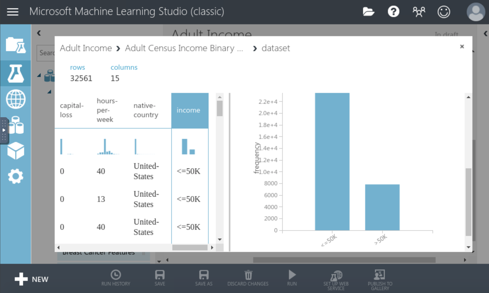

# Income Prediction with Azure ML Studio

Using the Adult Census data, I will build two boosted decision tree models (one model will be trained on the upsampled data, and the other with just the original pre-processed data) and create an end-to-end pipeline using Azure ML Studio. The objectives are the following:

- Pre-process the data
- Train and evaluate the model with Azure ML Studio
- Create scoring and predictive experiments
- Deploy the trained model as an Azure web service

### Task I- Introduction and Overview

- Create a new experiment from the Azure ML Studio dashboard
- Import and explore the Adult Census data before moving on to pre-processing

a) Importing the dataset

b) Viewing the class imbalance

### Task 2- Data Cleaning

- Clean the data
- Handle missing values
- Exclude irrelevant or redundant columns
- Once the final set of features is ready, use the Edit Metadata module to convert specific columns from string to categorical

a) Clean missing data

b) Exlcuding unnecessary columns

c) Using the Edit Metadata module to change datatypes

d) Converting Categorical Columns

### Task 3- Accounting for Class Imbalance

- Upsample the data, but only on the training data so that none of the information in the validation data is used to create synthetic observations. So these results should be generalizable.

a) Use the SMOTE (Synthetic Minority Over-sampling Technique) Module for Class Imbalance

### Task 4- Model Training and Hyperparameter Tuning

- Train a two-class boosted decision tree model to predict the income
- Perform hyperparameter tuning using the Tune Model Hyperparameters module

a) Split the Data (without SMOTE)

b) Implement Decision Tree Model

c) Splitting the Data Once More (with SMOTE)

d) Tune Model Hyperparameters Module

e) View of the ML Workflow

### Task 5- Scoring and Evaluating Models

- Compare how the two models perform using the Score Model and Evaluate Model modules
- Use AOC and ROC metrics for evaluation

a) Use Evaluate Model Module 

b) Results of Upsampled Decision Tree

c) Results of Normal Decision Tree

### Task 6- Publish the Trained Models as Web Service for Inference

- Create a web service from Azure Machine Learning prediction model
- Create a scoring / prediction experiment
- Publish the trained model as a web service

a) Deleted Normal Decision Tree Before Creating Web Service

b) Web Service Output

c) Predicting New, Unseen Data on the Decision Tree Model

d) Prediction- Scored Label

